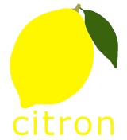

# Preprocessing PARC 3.0 #

Training models for Citron requires data in [Citron's Annotation Format](../../docs/data_format.md). Suitable data can be extracted from PARC 3.0 and PDTB v2.0 using the following scripts.

To retrain the Coreference Resolver suitable data can also be extracted from the CoNLL-2011 Shared Task dataset.

## Usage ##

All scripts require the Citron project directory in the PYTHONPATH.

    $ export PYTHONPATH=$PYTHONPATH:/path/to/citron

All scripts share the following parameters:

        -h, --help    (Optional: show help message and exit)
        -v            (Optional: verbose mode)

### conll_extractor.py ###

This is an optional script to extract coreference information from CoNLL-2011.

    --pdtb-path        Path to: pdtb_v2/data/raw/wsj
    --conll-path       Path to conll-2011
    --output-path      Path to output directory

### parc_extractor.py ###

This scripts extracts data from PARC 3.0 and PDTB v2.0.

    --parc-path        Path to: PARC3_complete directory
    --pdtb-path        Path to: pdtb_v2/data/raw/wsj
    --conll-path       Path to output directory of conll_extractor.py    (Optional: required to train CoreferenceResolver)
    --output-path      Path to output directory

### data_trimmer.py ###
This is an optional script which removes sentences from PARC 3.0 which have missing annotations. Removing these sentences from the training data can improve the performance of Citron's components.

A Cue Classifier is first trained with the untrimmed data obtained from parc_extractor.py. The Cue Classifier is then used with data_trimmer.py to identify and remove the problem sentences. All Citron's components can then be trained with the trimmed data.

    --input-path       Path to output directory of parc_extractor.py
    --output-path      Path to output directory
    --model-path       Path to Citron model directory  (containing cue-classifier.pickle)

Copyright 2021 British Broadcasting Corporation.
